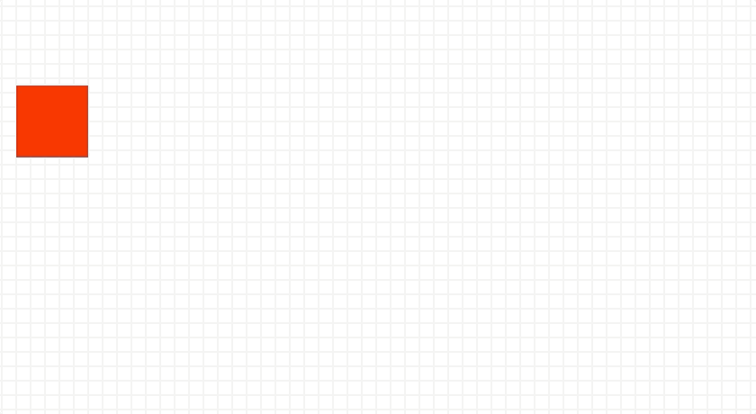
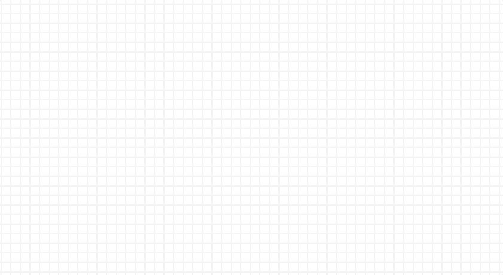
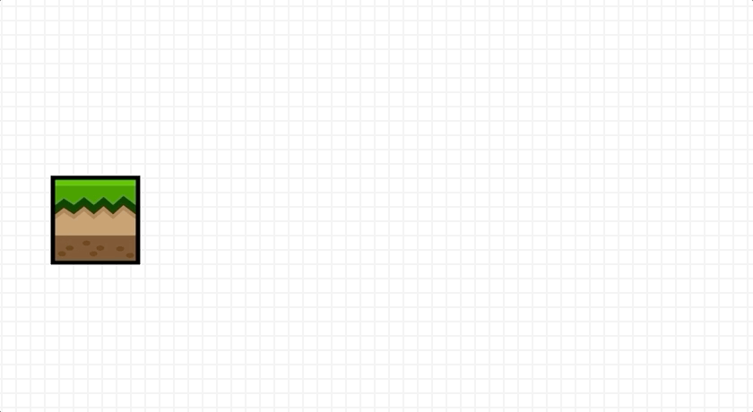
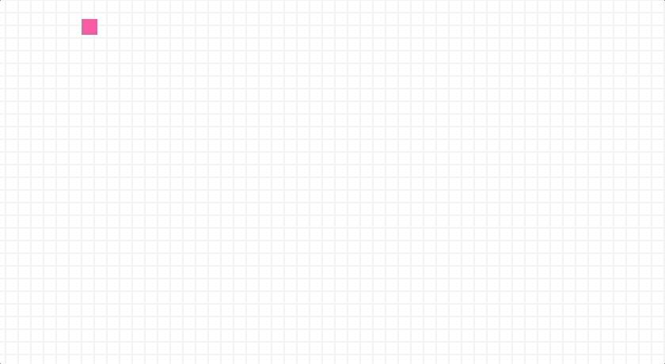

# Getting Started with the Basics

This is a quick overview of some examples that show how to animate tweens. Conveniently, all of these can be found in a single file: [/examples/ggez/gg_basics.rs](https://github.com/wasm-network/tweek-rust/blob/master/examples/ggez/gg_basics.rs), which lets you browse and test various examples. If you have Rust nightly installed, you can run these examples like this:

```
cargo run --bin basics 
```


## Animate square
This is the relevant code that creates a square and animates the position, size, and color in a 1-second animation. It also uses the ease() function to alter the motion speed to make it more interesting. And finally, it specifies the repeat count and delay and tells it to apply the "yoyo" effect. 

```rust
        let rect = Rect::new(150.0, 200.0, 80.0, 80.0);
        let mut item1 = Item::new(item_id, Shape::Rectangle(rect))?;
        item1.layer.graphics.color = Color::from_rgb_u32(HexColors::Red);

        let mut tween1 = Tween::with(item_id, &item1.layer)
            .to(vec![position(draw_area.right() as f64 - 120.0, 400.0), size(120.0, 120.0), color(HexColors::Gold)])
            .duration(1.0)
            .ease(Ease::SineInOut)
            .repeat(9, 0.2).yoyo()
            ;

        &tween1.play();
```

Note that the `to()` function above accepts a vector of functions that define what visual properties  will change during the specified duration. In this case, the *position*, *size*, and *color* are affected.




## Balloon bounce
This animation shows a purple circle that expands like a balloon and becomes more transparent, before it suddenly pops and deflates while flying off and bouncing off the walls. More specifically, this involves chaining animations within a Tween. Looking at the code sample below, you can see that multiple calls to the `to()` function are interpreted as sequenced animations in the overall Tween. 

```rust
        let mut item2 = Item::new(item_id, Shape::Circle(center_pt, 40.0))?;
        item2.layer.graphics.color = graphics::Color::from_rgb_u32(0xCD09AA);
        item2.layer.graphics.offset = Point2{x: 0.5, y: 0.5};

        let mut tween2 = Tween::with(item_id, &item2.layer)
            .to(vec![size(200.0, 200.0), alpha(0.9)]).duration(4.0)
            .to(vec![position(700.0, draw_area.top() as f64 + 40.0), size(100.0, 100.0), alpha(0.8)]).duration(0.2)
                        .ease(Ease::SineIn)
            .to(vec![position(draw_area.right() as f64, 200.0), size(50.0, 50.0), alpha(0.7)]).duration(0.2)
            .to(vec![position(650.0, draw_area.bottom() as f64), size(20.0, 20.0), alpha(0.6)]).duration(0.2)
            .to(vec![position(400.0, 300.0), size(5.0, 5.0), alpha(0.2)]).duration(0.2)
            .repeat(-1, 2.0);

        &tween2.play();
``` 

Note that the `repeat(-1, 2.0)` function call at the end specifies that it should repeat forever with a 2 second delay before starting the animation again. 



## Rolling tile
Here, we have an image loaded from the file system and rotated on its center axis while moving to the right. It uses the BounceOut ease to finish off the animation. 

```rust
        let tile = graphics::Image::new(ctx, "/tile.png")?;
        let rect = graphics::Rect::new(250.0, 400.0, 100.0, 100.0);
        let mut item3 = Item::new(ITEM_ID, Shape::Image(rect))?;
        item3.image = Some(tile);
        item3.layer.graphics.offset = Point2{x: 0.5, y: 0.5};

        let mut tween3 = Tween::with(ITEM_ID, &item3.layer)
            .to(vec![shift_x(600.0), rotate(360.0)]).duration(3.0)
            .ease(Ease::BounceOut)
            .repeat(5, 0.5)
            ;

        &tween3.play();
```




## Drawing elastic bars
And this is a sequence of chained animations that takes a square block and draws bars that expand and contract as it travels around the perimeter of a rectangle. Each step in the animation has a different Ease parameter which showcases some of the built-in timing effects.

```rust
        let w = 640.0 as f64;
        let h = 400.0 as f64;
        
        let item_id = 1;
        let mut item1 = Item::new(item_id, Shape::Rectangle(rect))?;
        item1.layer.graphics.color = Color::from_rgb_u32(HexColors::HotPink);

        let mut tween1 = Tween::with(item_id, &item1.layer)
            .to(vec![size(w, 20.0)]).duration(1.0)
                .ease(Ease::ElasticIn)
            .to(vec![size(20.0, 20.0), shift_x(w - 20.0)]).duration(1.0)
                .ease(Ease::ElasticOut)
            .to(vec![size(20.0, h)]).duration(1.0)
                .ease(Ease::BackIn)
            .to(vec![size(20.0, 20.0), shift_y(h - 20.0)]).duration(1.0)
                .ease(Ease::BackOut)
            .to(vec![size(w, 20.0), shift_x(-w + 20.0)]).duration(1.0)
                .ease(Ease::BounceIn)
            .to(vec![size(20.0, 20.0)]).duration(1.0)
                .ease(Ease::BounceOut)
            .to(vec![size(20.0, h), shift_y(-h + 20.0)]).duration(1.0)
                .ease(Ease::SineIn)
            .to(vec![size(20.0, 20.0)]).duration(1.0)
                .ease(Ease::SineOut)
            .repeat(-1, 0.2)
            // .debug()
            ;

        &tween1.play();
```

Note that you can add the `debug()` call to any Tween or manually set `tween.debug = true` to tell the system to print verbose information about the internal workings of the Tween animation. 



