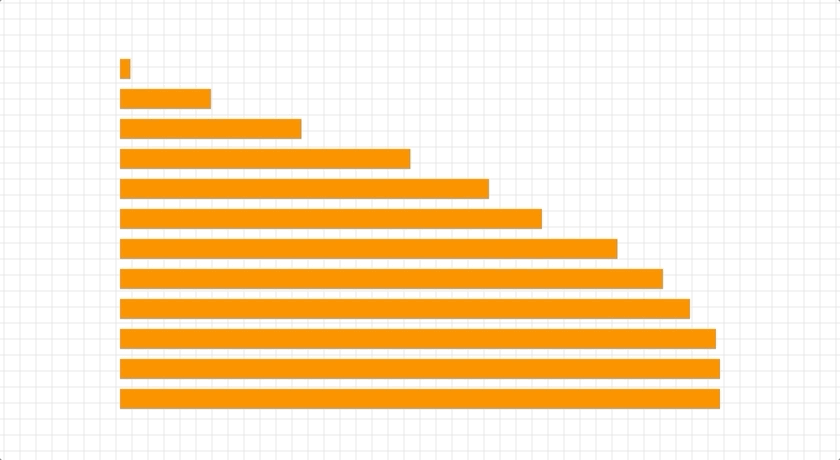
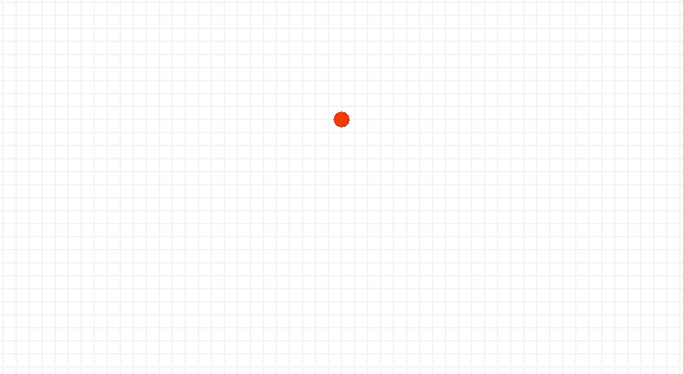

# Timeline Animations

The [Tween Basics examples](1-basics.md) are a good starting point for learning and playing around with different animation behaviors. However, if you need to animate more than a small number of objects, it is probably best to use a Timeline which groups together Tween animations and schedules them to start at specific times. 

These examples are all found within the file: [/examples/ggez/gg_demos.rs](https://github.com/wasm-network/tweek-rust/blob/master/examples/ggez/gg_demos.rs), which lets you browse the available demos easily. Please read the comments in this file which explain the important differences between running independent Tween animations versus a Timeline with several tweens. 

If you have Rust nightly installed, you can run these examples like this:

```
cargo run --bin demos 
```


## Staggered bars 
The following is a simple collection of bars that start small and extend to the right in a staggered timeline. This is very similar to animating a single tween, except that the play() function for each tween is not called. Instead the timeline will be responsible for that.

```rust
      let line_count = 12;

      for i in 0..line_count {
          let item_id = i as usize;
          let ypos = i as f32 * (BAR_HEIGHT + 10.0) + draw_area.top();

          let rect = Rect::new(draw_area.left(), ypos, 0.0, BAR_HEIGHT);

          let mut item = Item::new(item_id, Shape::Rectangle(rect))?;
          item.layer.graphics.color = Color::from_rgb_u32(HexColors::Orange);

          let tween = Tween::with(item_id, &item.layer)
              .to(&[size(draw_area.w as f64, BAR_HEIGHT as f64)])
              .duration(1.0)
              .ease(Ease::SineOut)
              .repeat(8, 0.2).yoyo()
              ;
          items.push(item);
          tweens.push(tween)
      }


      let timeline = Timeline::add(tweens)
          .stagger(0.1)
          ;
```



## Spinning dots in a circle

This is a similar demo where a collection of dots rotate around in a circle in a staggered timeline with some variation in speed because of the ease function that is applied. 

```rust
    let dot_count = 8;

    for i in 0..dot_count {
        let item_id = i + 10 as usize;

        let mut item1 = Item::new(item_id, 
			Shape::Circle(mint::Point2{x: center_pt.x, y: center_pt.y - scene_radius}, dot_radius))?;
        item1.layer.graphics.color = Color::from_rgb_u32(HexColors::Red);
        let alpha = 1.0 - (i as f32 / dot_count as f32)/2.0;
        item1.layer.graphics.color.a = alpha;
        item1.layer.graphics.offset = mint::Point2{ x: center_pt.x, y: center_pt.y };

        let tween1 = Tween::with(item_id, &item1.layer)
            .to(&[rotate(360.0)])
            .duration(1.8)
            .ease(Ease::SineInOut)
            .repeat(-1, 0.8)
            ;
        items.push(item1);
        tweens.push(tween1)
    }

    let timeline = Timeline::add(tweens)
        .stagger(0.12)
        ;
```



